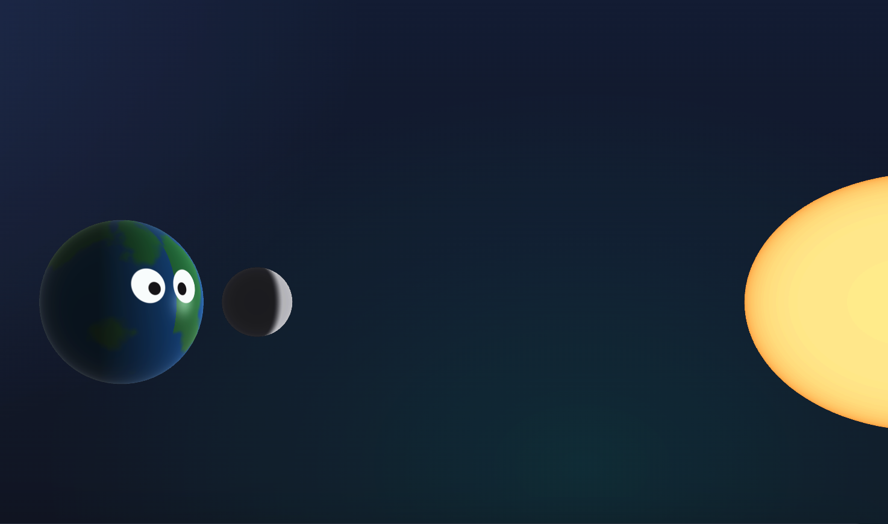

# Moon Phase Demo - Classroom Model
   
A simple, interactive demonstration to help understand why the Moon phases appear as they do from earth.

### Features:
- Manually or Automatically control the Moon through its 29.53 day orbit (Press spacebar to play/pause)
- Inset "Moon view" showing how the Moon appears from Earth
- Controls to toggle side view or top view (Press T)
- Controls to toogle between Earth and Person as a visual aid (Press P)
- Accurate(ish) Earth texture that rotates once per day
- 3D controls to pan, zoom, and orbit for different perspectives
- tiny!
- installable as a PWA for use offline

Enjoy!

[CLICK HERE TO TRY!](https://www.google.com)
